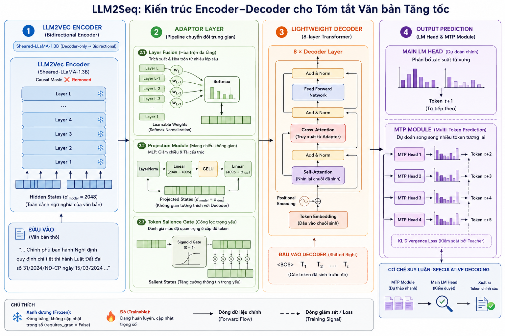

# Encoder-Decoder LLM Research

Nghiên cứu các kiến trúc Encoder-Decoder dựa trên LLM cho các bài toán sequence-to-sequence.

## LLM2Seq Architecture Overview

LLM2Seq được thiết kế nhằm tối ưu hóa việc truyền thông tin từ Encoder sang Decoder mà không làm suy giảm chất lượng:

- **LLM2Vec Encoder**: Mô hình encoder hai chiều xử lý context cực dài (được đóng băng ở Phase 1, dùng LoRA ở Phase 2).
- **Gated Residual Adaptor (Cầu nối Encoder-Decoder)**: Chuyển đổi và chắt lọc không gian chiều (dimension) từ Encoder sang Decoder một cách mượt mà. Khối cầu nối này bao gồm các thành phần con:
  - *Layer Fusion*: Tích hợp các đặc trưng theo token từ nhiều tầng khác nhau của encoder.
  - *Gated Residual Projection*: Ánh xạ chiều dữ liệu kết hợp với skip-connection để giữ thông tin gốc.
  - *Salience Gate*: Bộ lọc nội dung (token-level), loại bỏ các token dư thừa giúp decoder bớt nhiễu.
  - *EncStack*: Tinh chỉnh lại bộ nhớ (memory refinement) trước khi đưa vào Cross-attention.
  - *Global Memory Tokens*: Các token toàn cục học được (learnable) gắn vào đầu dãy memory để tóm lược đại ý văn bản.
- **Lightweight Decoder**: Decoder Transformer tự thiết kế (ví dụ cấu hình LLM2Seq: 8 layers, 1024 hidden size) chuyên trách việc sinh văn bản.
- **MTP (Multi-Token Prediction) Heads**: Các module phụ trợ (được train riêng ở Phase 3) giúp tăng tốc sinh từ bằng kỹ thuật Speculative Decoding (Dự đoán nhiều token cùng lúc).

## Evaluation Results: LLM2Seq vs T5Gemma2-1B-1B

Dưới đây là kết quả so sánh hiệu năng của **LLM2Seq (Phase 2 - LoRA Encoder)** với **T5Gemma-1b-1b (LoRA)** trên tập test WikiLingua (3,901 mẫu).

**Cấu hình mô hình:**
- **LLM2Seq (Llama Encoder)**: Sử dụng LLM2Vec-Sheared-LLaMA-mntp làm Encoder + Decoder Transformer tự thiết kế.
- **LLM2Seq (Qwen Encoder)**: Sử dụng Qwen3-Embedding-0.6B làm Encoder + Decoder Transformer tự thiết kế.

| **Chỉ số (Metric)** | **LLM2Seq (Llama Encoder)** | **LLM2Seq (Qwen Encoder)** | **T5Gemma (1B-1B)** | **Đánh giá chi tiết**                 |
| :--------------------| :---------------------------:| :--------------------------:| :-------------------:| :--------------------------------------|
| **Tổng tham số**    | ~1.5B                       | ~1B                        | ~2B                 | *T5Gemma lớn nhất, Qwen gọn nhẹ nhất* |
| **ROUGE-1**         | 48.36                       | 53.91                      | **54.24**           | *Qwen kéo LLM2Seq ngang ngửa T5Gemma* |
| **ROUGE-2**         | 15.54                       | 20.74                      | **27.42**           | *T5Gemma vẫn vượt trội về độ mượt*    |
| **ROUGE-L**         | 29.05                       | 31.77                      | **33.89**           | *T5Gemma nhỉnh hơn một chút*          |

*Ghi chú: Điểm được lấy ở Phase 2 của các mô hình LLM2Seq.*

### Phân tích & Nhận xét
1. **Sức mạnh của Qwen Encoder**: 
   - Việc thay đổi Encoder từ Llama sang **Qwen** đã mang lại sức mạnh vượt bậc cho LLM2Seq. Điểm ROUGE-1 tăng phi mã từ 48.36 lên 53.91, trực tiếp cạnh tranh sòng phẳng với T5Gemma (54.24).
   - Tuy nhiên, T5Gemma-1B-1B vẫn là mô hình sinh ra câu từ mượt mà, tự nhiên nhất.
2. **Kết luận**: 
   - **T5Gemma-1B-1B** phù hợp khi cần một đoạn tóm tắt diễn giải chi tiết, văn phong mượt mà tự nhiên.
   - **LLM2Seq (Qwen)** là kiến trúc toàn diện: chất lượng ROUGE tương đương T5Gemma và năng lực tóm tắt súc tích, đi thẳng vào vấn đề.

---

## Evaluation Results: Phase 3 (MTP Speedup)

Dưới đây là kết quả đánh giá tốc độ sinh văn bản của kiến trúc **MTP (Multi-Token Prediction)** so với phương pháp sinh từng từ truyền thống (Autoregressive Baseline) trên tập WikiLingua.

| **Chỉ số (Metric)** | **Autoregressive (Baseline)** | **MTP (Verified Decoding)** | **Nhận xét (Tăng trưởng)** |
| :--- | :---: | :---: | :--- |
| **Tốc độ (Tokens/bước)** | 1.00 | **2.41** | 🚀 **Giảm 2.4 lần** số bước lặp tính toán |
| **Độ trễ trung bình (s)** | 0.78s | **0.66s** | ⚡ **Nhanh hơn ~18 - 25%** |
| **ROUGE-1** | 54.01 | 53.90 | 💎 Chất lượng giữ nguyên (Lossless) |
| **ROUGE-2** | 20.83 | 20.81 | 💎 Chênh lệch vô cùng nhỏ |
| **ROUGE-L** | 31.83 | 31.64 | 💎 Tương đương bản gốc |

### Điểm mạnh cốt lõi:
1. **Kiến trúc Cascaded MTP:** Các token nháp được dự đoán nối tiếp (có tính nhân quả), giúp tỷ lệ đoán trúng (Acceptance Rate) ở token đầu tiên lên tới ~30%.
2. **Parallel Verification (Kiểm duyệt song song):** Main Head đánh giá đồng thời 4 token nháp trong 1 chu kỳ GPU. Kết hợp việc sinh thêm 1 token đúng, mỗi bước nhảy mô hình đẻ ra trung bình **2.4 token**.
3. **Lossless Quality (Nhanh nhưng Không ẩu):** Tốc độ thực tế tăng trên 20% nhưng không phải đánh đổi bằng độ chính xác (Delta ROUGE < 0.2). Chất lượng văn bản tóm tắt được giữ nguyên vẹn 100% so với Baseline.

---

## Technical Details: Mathematics and Architecture

### 1. Gated Residual Adaptor (Encoder-Decoder Bridge)
Nhiệm vụ của khối Adaptor là chuyển đổi không gian biểu diễn (representation space) từ kích thước $d_{enc}$ của Encoder sang $d_{dec}$ của Decoder một cách chọn lọc.

- **Layer Fusion (Trộn đặc trưng nhiều tầng):**
  Trọng số chú ý $w_i$ được học để tự động kết hợp thông tin từ các layer khác nhau của Encoder.
  $$w_i = \text{Softmax}(\text{Linear}(h_i))$$
  $$H_{fused} = \sum_{i} w_i h_i$$
  
- **Gated Residual Projection (Cơ chế cổng bảo toàn thông tin gốc):**
  Bảo toàn một luồng dữ liệu gốc $\text{base}$ và học một bản cập nhật $\text{update}$ được điều tiết bởi cổng $\text{gate}$ (giống cơ chế của GRU/LSTM).
  $$\text{base} = W_{base} \cdot \text{LayerNorm}(H_{fused})$$
  $$\text{gate} = \sigma(W_{gate} \cdot \text{LayerNorm}(H_{fused}))$$
  $$\text{update} = \text{FFN}(\text{LayerNorm}(\text{base}))$$
  $$H_{adaptor} = \text{base} + \text{gate} \odot \text{update}$$

### 2. Lightweight Decoder Architecture
Decoder là một mạng Transformer tiêu chuẩn được làm nhẹ (lightweight) chỉ tập trung vào việc xử lý ngôn ngữ đích.

Mỗi layer của Decoder áp dụng tuần tự:
1. **Masked Self-Attention:** 
   $$H_{self} = \text{SelfAttention}(Q=H_{dec}, K=H_{dec}, V=H_{dec})$$
2. **Cross-Attention:** Kết nối chặt chẽ với biểu diễn đã được cô đặc từ Adaptor.
   $$H_{cross} = \text{CrossAttention}(Q=H_{self}, K=H_{adaptor}, V=H_{adaptor})$$
3. **Feed-Forward Network (FFN):**
   $$H_{out} = \text{FFN}(\text{LayerNorm}(H_{cross})) + H_{cross}$$

### 3. Phase 3: Multi-Token Prediction (MTP) & Self-Distillation
Thay vì chỉ đoán 1 token, MTP thiết lập $K$ draft heads (thường $K=4$) để dự đoán trước tương lai $K$ bước.

Hàm mất mát (Loss) trong Phase 3 là sự kết hợp của Cross-Entropy truyền thống và KL Divergence (Chưng cất tri thức từ chính Main Head):
$$\mathcal{L} = \lambda_{CE} \mathcal{L}_{CE} + \lambda_{KL} \mathcal{L}_{KL}$$

- **MTP Cross-Entropy (Dự đoán từ cứng - Hard labels):**
  $$\mathcal{L}_{CE} = - \sum_{k=1}^{K} w_k \log P_{MTP}^{(k)}(y_{t+k} | y_{\le t})$$
  
- **Self-Distillation KL Divergence (Chưng cất tri thức mềm - Soft labels):**
  Ép các Draft Heads (học trò) học theo toàn bộ biểu đồ xác suất phân vân (dark knowledge) của Main Head (thầy giáo).
  $$\mathcal{L}_{KL} = \sum_{k=1}^{K} w_k \sum_{v \in \mathcal{V}} P_{Main}(v | y_{\le t+k-1}) \log \frac{P_{Main}(v | y_{\le t+k-1})}{P_{MTP}^{(k)}(v | y_{\le t})}$$
Trong đó, $\lambda_{KL}$ (tương ứng với tham số `MTP_KL_w` trong log) sẽ được tăng dần (warmup) từ 0 lên một mức tối đa để giữ tính ổn định trong giai đoạn đầu.
