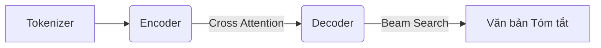

# Encoder-Decoder LLM cho Tóm tắt Văn bản Tiếng Việt

Dự án này triển khai cấu trúc mô hình lai (Encoder-Decoder) bằng cách chuyển đổi từ các mô hình ngôn ngữ lớn (LLM) kiến trúc Decoder-Only, chuyên biệt hóa cho bài toán tóm tắt văn bản dài bằng tiếng Việt.

## 🚀 Tính năng

- **Thích ứng kiến trúc (Adaptation):** Chuyển đổi LLM Decoder-Only (Gemma, Qwen, Llama) sang Encoder-Decoder.
- **Khởi tạo thông minh:** Hỗ trợ khởi tạo `cross-attention` từ `self-attention` và khởi động mềm (Warmup).
- **Tối ưu hóa (Tied Embeddings):** Chia sẻ trọng số ma trận nhúng, tiết kiệm 10.5% tham số.
- **Kiến trúc bất đối xứng:** Hỗ trợ Encoder và Decoder có kích thước khác nhau (ví dụ 9B-2B).
- **Dataset tiếng Việt:** Tích hợp bộ dữ liệu `VietNews` (143k bài báo).
- **Giao diện Demo:** Ứng dụng Streamlit hiển thị quá trình tóm tắt và phân tích hiệu suất thời gian thực.

## 📦 Cài đặt

```bash
python3 -m venv .venv
source .venv/bin/activate
pip install -U pip
pip install -r requirements.txt
```

## 🛠️ Hướng dẫn sử dụng

### 1. Khởi tạo mô hình chuyển đổi

Dự án sử dụng các tệp cấu hình YAML trong thư mục `configs/`.

Chạy smoke test (GPT-2):
```bash
python scripts/build_adapted_model.py \
  --config configs/smoke_test.yaml \
  --output_dir outputs/smoke-ed
```

Chạy với mô hình thật (Qwen 0.5B):
```bash
python scripts/build_adapted_model.py \
  --config configs/vietnews_qwen.yaml \
  --output_dir outputs/qwen-ed
```

### 2. Huấn luyện mô hình (Summarization)

```bash
python scripts/train_summarization.py \
  --config configs/smoke_test.yaml \
  --model_dir outputs/smoke-ed \
  --output_dir outputs/smoke-ed-cnn
```

### 3. Đánh giá (ROUGE & BERTScore)

```bash
python scripts/eval_summarization.py \
  --config configs/smoke_test.yaml \
  --model_dir outputs/smoke-ed-cnn
```

### 4. Khởi chạy Demo App

```bash
streamlit run scripts/demo_streamlit.py
```

## 📈 Kiến trúc hệ thống


